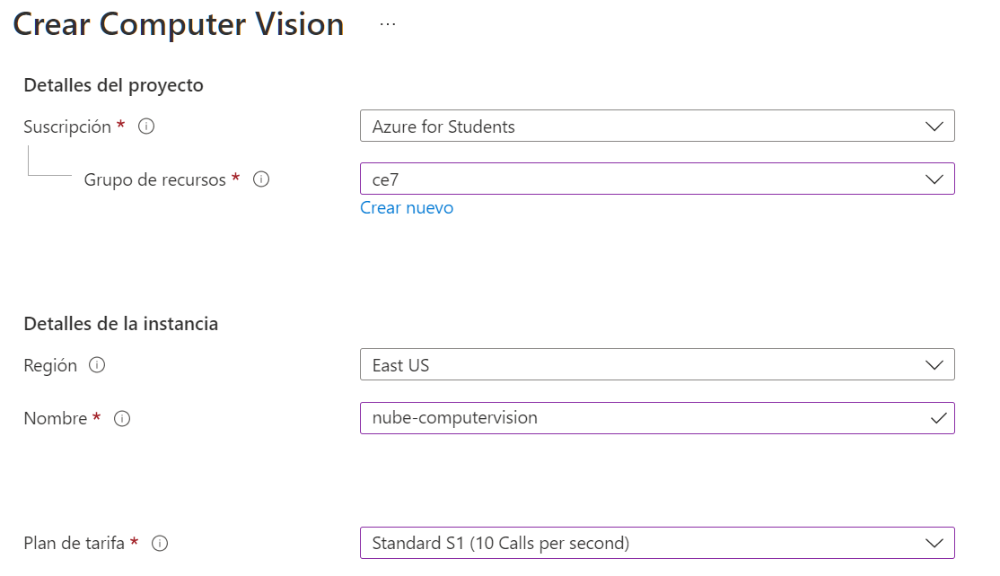
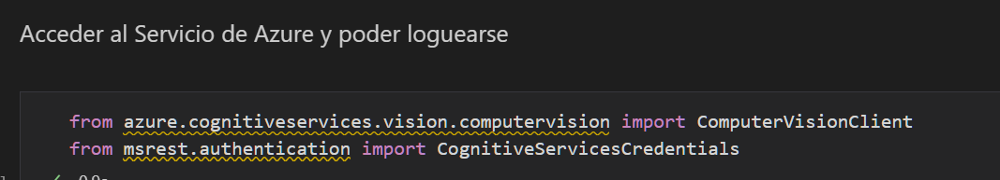
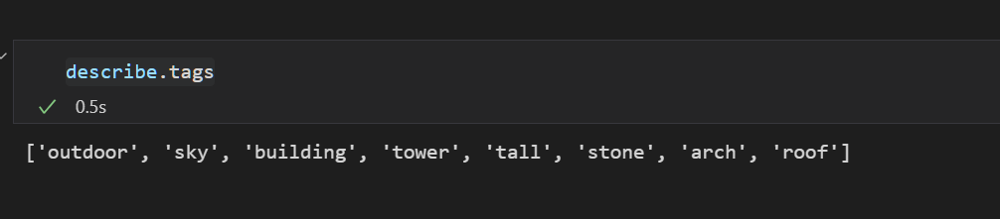
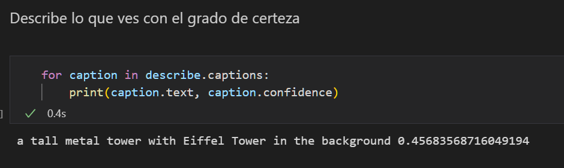
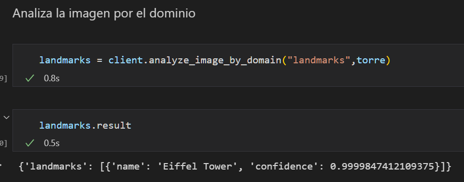

# Azure Computer Vision

## Objetivo
Analizar una imagen por medio de Azure Computer Vision

### Imagen base
 

### Instrucciones
1. En el portal de azure buscar "Computer Vision" y crear el recurso 
2. Introducir los detalles del proyecto
- Grupo de recursos
- Nombre
- Plan de tarifa

   

3. Dentro del recurso creado, ir a Administración de recursos / Claves y punto de conexión y copiar
- Clave 1
- Endpoint Extremo
- Ubicación
4. Ir Code Spaces o en VS Code local
5. En un nuevo proyecto crear la carpeta "ComputerVision"
6. Crear un Notebook "Computer-Demo.ipynb"
7. Digitar el código para introducir ruta de imagen y credenciales de Azure

 
 
 
 

### código
[Programa](ComputerVision/Computer-Demo.ipynb)