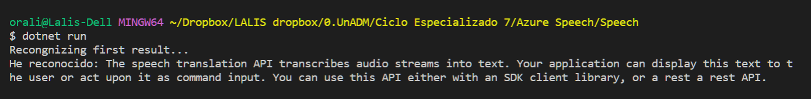

# Azure Speech

## Instrucciones
1. Dentro del portal de azure, buscar Speech
2. Introducir los detalles del proyecto
- Grupo de recursos
- Nombre
- Plan de tarifa

   

3. Dentro del recurso creado, ir a Administración de recursos / Claves y punto de conexión y copiar
- Clave 1
- Endpoint Extremo
- Ubicación
4. Ir Code Spaces o en VS Code 
5. Crear una capeta Speech dentro de un nuevo proyecto
6. Usar Git Bash terminal, irse al directorio de la carpeta (cd Speech)
7. Crear un proyecto de C# mediante el comando "dotnet new console"
8. Descargar el WAV de muestra del repositorio de https://github.com/MicrosoftLearning/AI-SpeechToText
- Se puede usar cualquier archivo de audio WAV
- El archivo debe estar dentro de la carpeta del programa Speech 
9. Añadir el paquete al proyecto por medio del comando "dotnet add package Microsoft.CognitiveServices.Speech"
10. Codificar la aplicación en Program.cs con lod datos de clave, endpoint y ubicacion
 
[Program](/Speech/Program.cs)
11. Correr el programa con el comando "dotnet run"
12. El transcript del audio se desplegará en terminal output 
 
