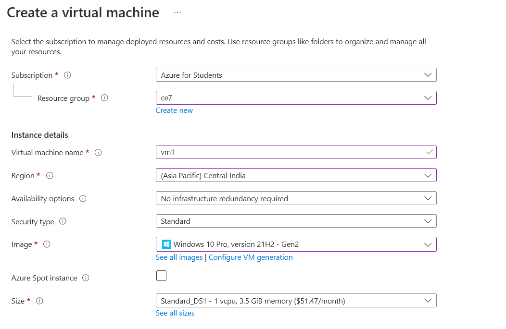
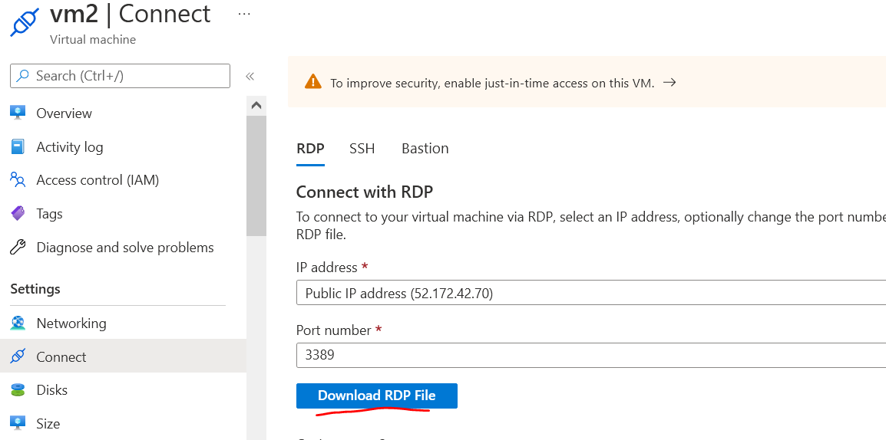
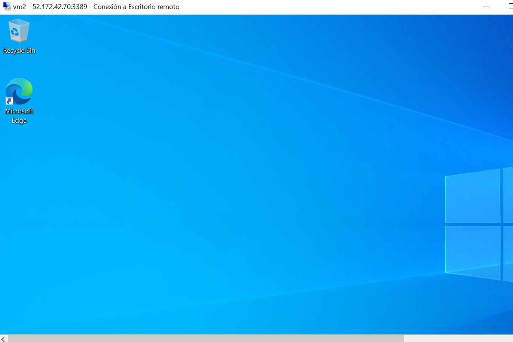
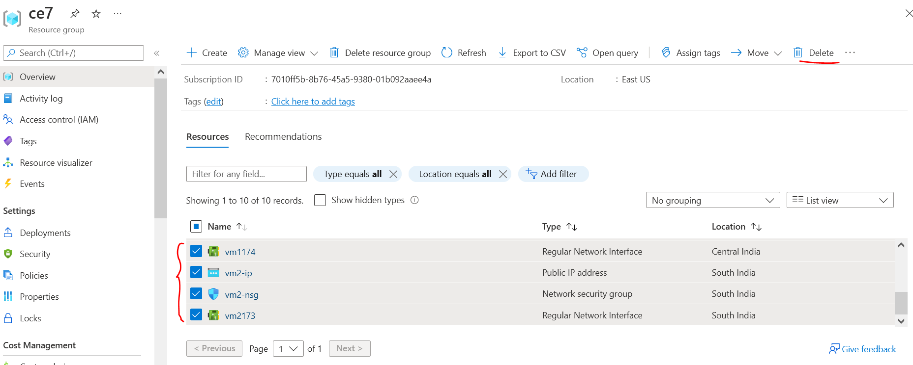

# Azure Virtual Machine

## Objetivo
Crear una máquina virtual usando el servicio de Azure Virtual Machine

### Creación de la VM
1. En el portal de azure (portal.azure.com) buscar "Virtual Machine"
2. Clic en "Crear" para crear el recurso 
3. Introducir los detalles del proyecto
- Grupo de recursos
- Nombre del máquina virtual
- Centro de datos a utilizar (region)
- Opciones de disponibilidad (backup/redundancia)
- Imagen (SO a instalar) 
- Tamaño (características de la VM)
- Usuario y Contraseña de la VM
- Puerto de entrada: RPD  (para comunicarse con la computadora) 
- Discos y Redes (se puede dejar con el default)    

 

### Conexión remota con la VM
1. Ir al recurso de la VM en el portal de Azure
2. En Conectar / RPD/ Descargar archivo RDP   

 

3. Descargar y abrir el archivo en la computadora local 
4. Aceptar y la conexión
5. Introducir usuario y contraseña de la VM
6. Aceptar la conexión a escritorio remoto 
7. Usar la computadora virtual    

     

### Borrado de la VM
1. Dentro del recurso
2. Detener el recurso y dar en Eliminar
3. Ir al grupo de recursos 
4. Eliminar los recursos adicionales uno por uno
   

