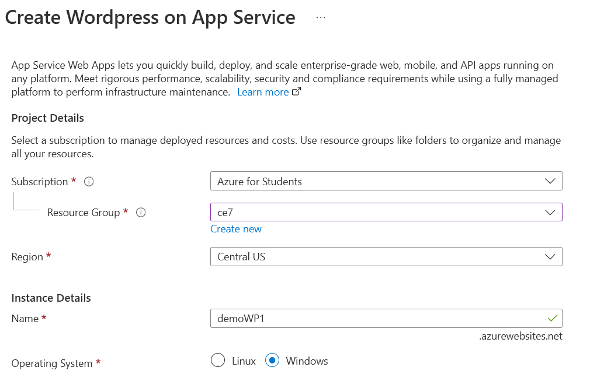
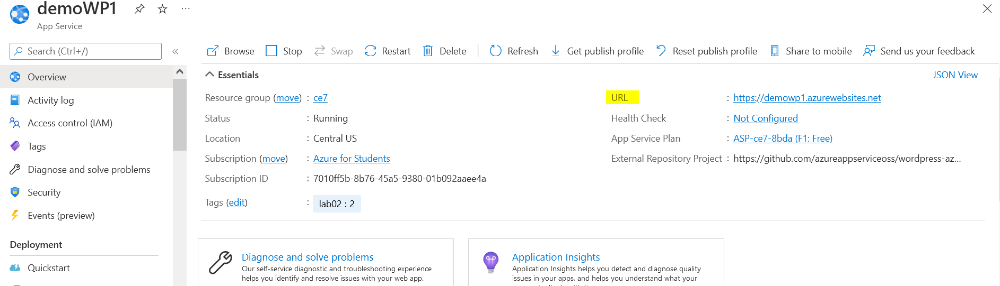
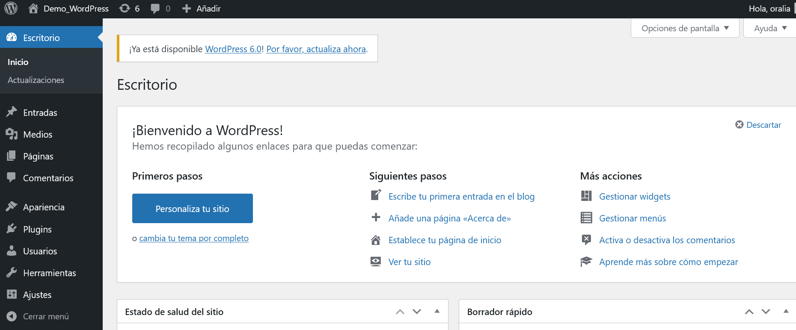
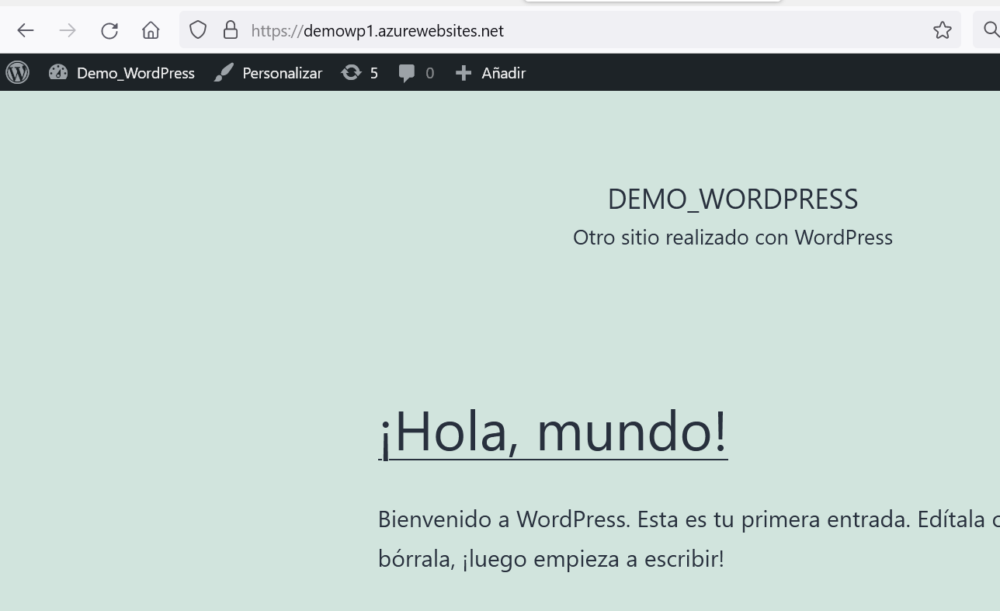

# Azure App Services

## Objetivo
Desplegar un sitio web de WordPress haciendo  uso de Azure App Services 

### Instrucciones 
1. En el portal de azure (portal.azure.com) buscar "WordPress"
2. Crear el recurso 
3. Introducir los detalles del proyecto:
- Grupo de recursos
- Region (depende de dónde van a estar los usuarios) 
- Nombre de la aplicación
4. Clic en Create
 

### Administrar la página
1. Ir al recurso en la página de Azure
2. Abrir el link ubicado en el campo de URL
 
3. Si es la primera vez que se abre, completar la configuración de Inicio
4. Click en Acceder
5. Usar el nombre de usuario y contraseña para entrar a la aplicación de WordPress        

    
  
 

